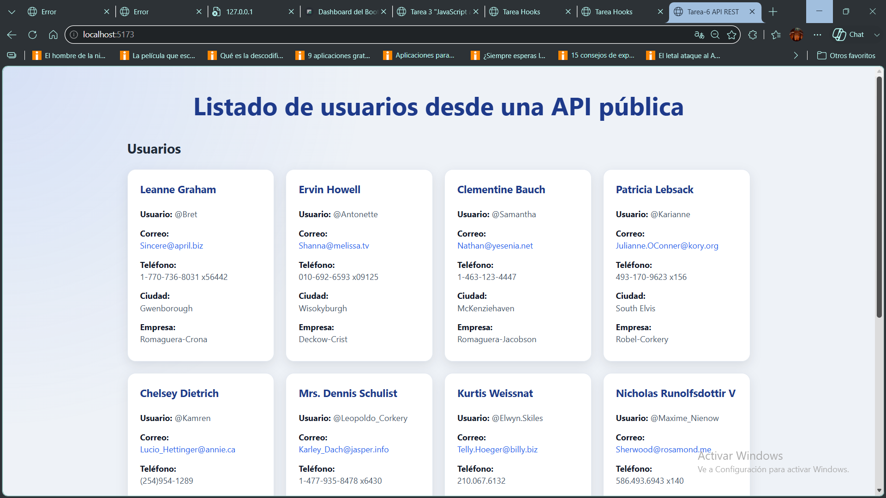
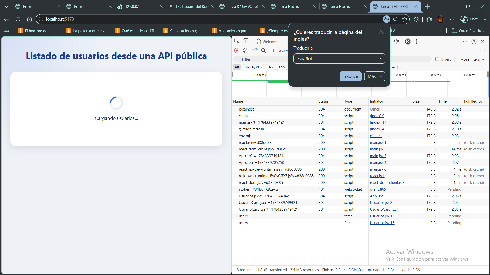
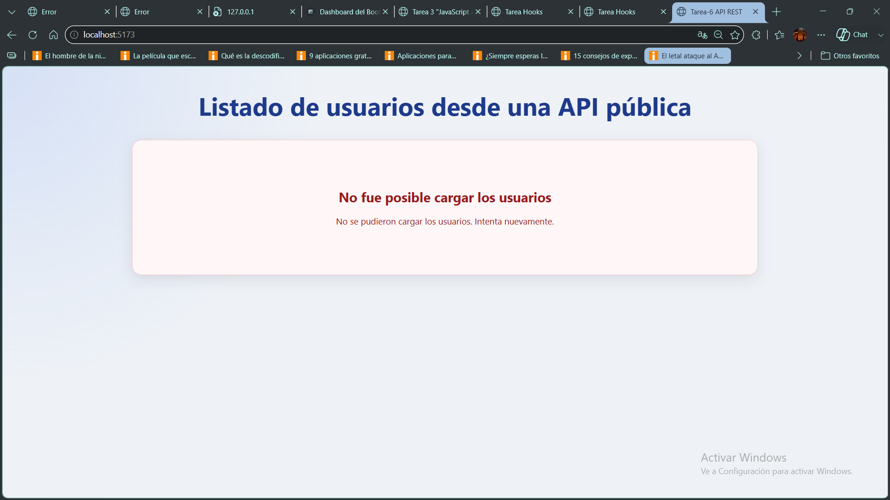

# Listado de Usuarios desde una API Pública

Proyecto desarrollado como práctica académica para la **Tarea del Módulo 2 - Unidad 2** de **Desarrollo en React JS**.

La aplicación implementa el consumo de una **API REST pública** utilizando **React Hooks**, obteniendo y mostrando dinámicamente un listado de usuarios mediante solicitudes HTTP. Además, incorpora estados de carga, manejo de errores y una interfaz responsive basada en componentes reutilizables.

---

# Objetivos del proyecto

Este proyecto fue desarrollado con el objetivo de aplicar y comprender el consumo de APIs REST dentro de React, implementando una aplicación funcional que permita:

- ✅ Consumir una API REST pública utilizando `fetch()`.
- ✅ Obtener datos de manera asincrónica.
- ✅ Mostrar la información recibida mediante componentes reutilizables.
- ✅ Implementar estados de carga y manejo de errores.
- ✅ Organizar la aplicación mediante componentes y props.
- ✅ Aplicar estilos responsive utilizando CSS.

---

# Hooks utilizados

| Hook | Función dentro del proyecto |
|------|------------------------------|
| `useState` | Administración del estado de usuarios, carga y errores. |
| `useEffect` | Ejecución automática de la consulta HTTP al cargar la aplicación. |

---

# Funcionalidades

- Obtener usuarios desde una API pública.
- Mostrar la información utilizando componentes reutilizables.
- Renderizar dinámicamente los datos mediante `.map()`.
- Mostrar un estado de carga mientras se reciben los datos.
- Mostrar un mensaje de error si la consulta falla.
- Diseño responsive para computadoras, tablets y teléfonos móviles.

---

# Estructura del proyecto

- **Clase-6/**
  - **public/**
    - capturas/
  - **src/**
    - **assets/**
    - **components/**
      - `UsuarioCard.jsx`
      - `Usuarios.jsx`
    - `App.jsx`
    - `App.css`
    - `main.jsx`
  - `package.json`
  - `vite.config.js`
  - `README.md`

---

# Instalación

1. Clonar el repositorio: `git clone https://github.com/NDanielBarrera/Tarea-6.git`
2. Ingresar al proyecto: `cd Clase-6`
3. Instalar dependencias: `npm install`
4. Ejecutar la aplicación: `npm run dev`
5. Abrir: `http://localhost:5173/`

---

# Capturas de pantalla

## Aplicación funcionando

---

## Estado de carga

---

## Estado de error

---

# Consumo de la API

La aplicación realiza una solicitud HTTP mediante la función `fetch()` hacia la siguiente API pública:

https://jsonplaceholder.typicode.com/users

Los datos obtenidos son almacenados en el estado de React y posteriormente renderizados mediante componentes reutilizables.

---

# Tecnologías utilizadas

- React 19
- Vite
- JavaScript (ES6+)
- HTML5
- CSS3
- Fetch API
- JSONPlaceholder API

---

# Conceptos aplicados

Durante el desarrollo fueron implementados los siguientes conceptos de React:

- Componentes funcionales.
- Hooks.
- Props.
- Consumo de APIs REST.
- Fetch API.
- Programación asincrónica con `async / await`.
- Manejo de estados mediante `useState`.
- Ciclo de vida con `useEffect`.
- Renderizado dinámico mediante `.map()`.
- Componentización.
- Diseño responsive.
- Manejo de errores.
- Estados de carga.

---

# Autor

Nombre: Néstor Daniel Barrera

Curso: **Certificación Full Stack Web Development con React.js**

Módulo 2 - Unidad 2

Año: 2026

---

# Bibliografía

- React Documentation. https://react.dev
- React - useState. https://react.dev/reference/react/useState
- React - useEffect. https://react.dev/reference/react/useEffect
- React - Rendering Lists. https://react.dev/learn/rendering-lists
- MDN Web Docs - Fetch API. https://developer.mozilla.org/docs/Web/API/Fetch_API
- JSONPlaceholder. https://jsonplaceholder.typicode.com
- Vite Documentation. https://vite.dev
- Material de estudio UTN BA Centro de e-learning.